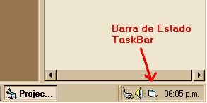



## Icono en la Barra de Estado \- Task Bar Icon

### Description

Con este formulario tú podrás puedes poner a tu sistema con un icono en la Barra de Estado ( junto al reloj ) cuando lo minimices. -- With this form you can put to your system with an icon in the Task Bar (next to the clock) when you minimized it.
 
### More Info
 

             |
---                |---
**Submitted On**   |2002-02-22 09:33:46
**By**             |[Fantasmita](https://github.com/Planet-Source-Code/PSCIndex/blob/master/ByAuthor/fantasmita.md)
**Level**          |Intermediate
**User Rating**    |4.7 (14 globes from 3 users)
**Compatibility**  |VB 6\.0
**Category**       |[Custom Controls/ Forms/  Menus](https://github.com/Planet-Source-Code/PSCIndex/blob/master/ByCategory/custom-controls-forms-menus__1-4.md)
**World**          |[Visual Basic](https://github.com/Planet-Source-Code/PSCIndex/blob/master/ByWorld/visual-basic.md)
**Archive File**   |[Icono\_en\_l568292222002\.zip](https://github.com/Planet-Source-Code/fantasmita-icono-en-la-barra-de-estado-task-bar-icon__1-32021/archive/master.zip)

